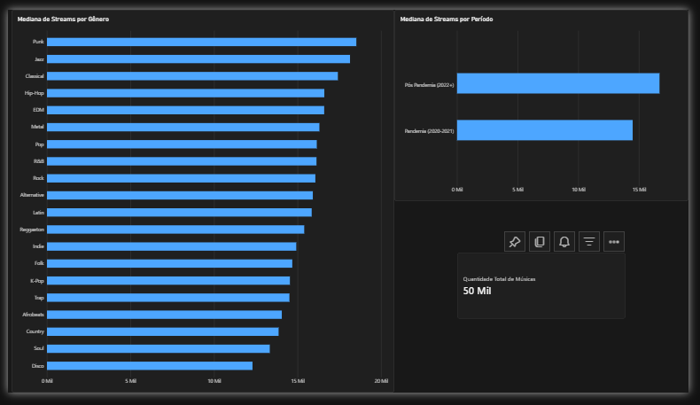

# 🎧 Spotify Streaming Analytics (2020–2025)

Pipeline de dados construído no Databricks para analisar padrões de streaming musical
entre 2020 e 2025, explorando como métricas de popularidade se comportam por gênero
e como o comportamento de consumo mudou entre o período de pandemia e pós-pandemia.

O projeto cobre o ciclo completo: ingestão de dados brutos, transformação em camadas
(arquitetura Medallion), e disponibilização de dados prontos para consumo em BI.

**Tecnologias utilizadas:**
- Databricks (PySpark, Delta Lake, Unity Catalog)
- SQL
- Power BI

**Fonte dos dados:** [Spotify Artist Streaming Analytics 2020-2025 (Kaggle)](https://www.kaggle.com/datasets/beamhonor0911/spotify-artist-streaming-analytics-20202025)

---

## 🏗️ Arquitetura do Pipeline

O projeto segue a arquitetura **Medallion** (Bronze → Silver → Gold), um padrão
amplamente utilizado em engenharia de dados para separar responsabilidades entre
ingestão, tratamento e consumo dos dados.

```
CSV (Kaggle)
│
▼
Volume (Unity Catalog)
│
▼
🥉 Bronze → dado bruto, sem nenhuma transformação
│
▼
🥈 Silver → dado tratado (colunas derivadas, remoção de redundâncias)
│
▼
🥇 Gold → dados agregados, prontos para consumo em BI
│
▼
Power BI
```


### 🥉 Bronze — dado bruto
O CSV original é lido e gravado como tabela Delta, sem nenhuma alteração.
O objetivo é preservar uma cópia fiel da fonte, servindo como "fonte da verdade"
caso seja necessário reprocessar o pipeline do zero.

```python
df = spark.read.csv(
    "/Volumes/files/spotify_files/volumes/spotify_artist_streaming_2020_2025.csv",
    header=True,
    inferSchema=True
)

df.write.format("delta").mode("overwrite").saveAsTable("files.spotify_files.spotify_bronze")
```

### 🥈 Silver — dado tratado
A partir da Bronze, foram aplicadas duas transformações:
- Criação da coluna `Periodo`, classificando cada música como lançada durante a
  pandemia (2020-2021) ou no período pós-pandemia (2022+).
- Remoção da coluna `explicit`, após validar que era idêntica a `is_explicit_bool`
  (checagem feita antes de remover, comparando as duas colunas linha a linha).

```python
df_silver = df_bronze.withColumn(
    "Periodo",
    F.when(F.col("release_year").isin(2020, 2021), "Pandemia (2020-2021)")
     .otherwise("Pós-Pandemia (2022+)")
).drop("explicit")

df_silver.write.format("delta").mode("overwrite").saveAsTable("files.spotify_files.spotify_silver")
```

### 🥇 Gold — dados agregados
Duas tabelas Gold foram criadas, cada uma respondendo a uma pergunta analítica
específica, já prontas para consumo direto no Power BI:

| Tabela | Pergunta que responde |
|---|---|
| `spotify_gold` | Qual a mediana de streams por gênero? |
| `spotify_gold_periodo` | Como a mediana de streams se compara entre pandemia e pós-pandemia? |

```python
df_gold_genero = df_silver.groupBy("genre") \
    .agg(
        F.count("*").alias("qtd_musicas"),
        F.expr("percentile_approx(stream_count, 0.5)").alias("mediana_streams")
    )

df_gold_genero.write.format("delta").mode("overwrite").saveAsTable("files.spotify_files.spotify_gold")
```

> **Por que mediana, e não média?** Ver seção de Insights abaixo.

---

## 🔍 Principais Descobertas

### 1. Média vs. Mediana: cuidado com métricas de streams

A média de `stream_count` no dataset é de **118.378**, mas a mediana é de apenas
**15.547** — quase 8x menor. Essa diferença enorme indica uma distribuição fortemente
assimétrica (*right-skewed*): a maioria das músicas tem um volume de streams modesto,
mas uma pequena parcela de "hits" (incluindo um outlier de mais de 43 milhões de
streams) distorce qualquer média calculada.

**Implicação prática:** usar a média como métrica de comparação (por gênero, por
artista, por período) produz conclusões enganosas. A mediana é a métrica mais
confiável para descrever o comportamento "típico" desse tipo de dado.

### 2. Tamanho de amostra importa mais do que parece

Ao comparar a mediana de streams por gênero, gêneros com poucas músicas no dataset
(como Punk, com apenas 384 músicas, ou Disco, com 198) aparecem nos extremos do
ranking — tanto no topo quanto na base. Já gêneros com milhares de músicas (Pop,
R&B) convergem para valores de mediana muito próximos entre si.

**Implicação prática:** qualquer conclusão do tipo "o gênero X performa melhor" deve
vir acompanhada do tamanho da amostra — sem isso, o ranking pode refletir ruído
estatístico, não uma diferença real de comportamento.

### 3. Streams: Pandemia vs. Pós-Pandemia

A mediana de streams é cerca de **15% maior** no período pós-pandemia (16.693)
comparado ao período de pandemia (14.481). Os dois grupos têm tamanho de amostra
robusto (16.742 e 33.258 músicas, respectivamente), o que torna essa comparação
mais confiável que a análise por gênero.

**Ressalva:** essa diferença pode ser parcialmente explicada pelo tempo de exposição
— músicas lançadas em 2020/2021 tiveram mais tempo para acumular streams até a data
de coleta dos dados do que músicas lançadas mais recentemente, o que pode mascarar
o efeito real do período em si.

## 🛠️ Desafios e Como Resolvi

Documentar os problemas reais encontrados no caminho é tão importante quanto mostrar
o resultado final — cada um desses casos me ensinou algo sobre validação de dados e
disciplina de engenharia.

### 1. Path incorreto ao ler o arquivo do Volume

**Problema:** ao tentar ler o CSV a partir de outro notebook, digitei o caminho do
Volume de memória, e errei o nome do schema e a estrutura de pastas, gerando o erro
`CLOUD_INVALID_PATH`.

**Solução:** em vez de tentar adivinhar o path correto, usei `dbutils.fs.ls()` para
listar o conteúdo real do Volume e confirmar o caminho exato antes de reescrever o
código.

**Aprendizado:** nunca digitar paths de memória — sempre confirmar contra a fonte
real antes de assumir que está certo.

### 2. Bug silencioso no cálculo da mediana (vírgula vs. ponto)

**Problema:** ao calcular a mediana de streams por gênero, usei
`percentile_approx(stream_count, 0,5)` (vírgula, em vez de ponto) dentro de uma
expressão SQL. O código **rodou sem nenhum erro**, mas o resultado estava
completamente errado — os valores ficaram próximos do mínimo de cada grupo, não da
mediana.

**Causa raiz:** a vírgula foi interpretada como separador de argumentos da função
SQL, então `percentile_approx(stream_count, 0, 5)` foi lido como "calcule o
percentil 0 (o mínimo), com precisão 5" — um cálculo totalmente diferente do
pretendido.

**Solução:** comparar o resultado obtido com um cálculo anterior já validado (a
mesma métrica, calculada em uma etapa exploratória diferente). A discrepância
apontou que algo estava errado, mesmo sem nenhuma mensagem de erro.

**Aprendizado:** esse foi o bug mais importante do projeto — reforçou que código
sem erro não é sinônimo de resultado correto. Comparar resultados novos contra
valores já conhecidos é essencial antes de confiar em qualquer métrica.

### 3. Validação antes de remover colunas aparentemente duplicadas

**Problema:** o dataset trazia as colunas `explicit` e `is_explicit_bool`, ambas
booleanas e aparentando conter a mesma informação. Antes de remover uma delas na
camada Silver, seria fácil assumir que eram idênticas apenas pela aparência.

**Solução:** rodei uma verificação cruzada (`groupBy` das duas colunas juntas) para
confirmar que os valores realmente coincidiam em 100% das linhas, antes de decidir
qual coluna remover.

**Aprendizado:** nunca remover ou unificar colunas por suposição — sempre validar
com uma consulta antes de tomar decisões que descartam informação.

## 📊 Resultado Final

O pipeline completo alimenta um dashboard no Power BI, conectado diretamente às
tabelas Gold via Databricks SQL Warehouse, permitindo consultas ao vivo sem
necessidade de exportar arquivos manualmente.



O dashboard apresenta:
- Mediana de streams por gênero, com contagem de amostra disponível via tooltip
  (para evitar interpretações equivocadas em gêneros com poucas músicas).
- Comparativo de mediana de streams entre o período de pandemia e pós-pandemia.

---

📓 [Ver notebook completo de exploração](notebooks/01_exploracao_spotify.py)  
📓 [Ver notebook completo do pipeline](notebooks/02_pipeline_bronze_silver_gold.py)

---

**Autor:** [Igor de Souza Aguiar](https://github.com/IgorSouzDEV)  
**LinkedIn:** [Igor de Souza Aguiar](https://www.linkedin.com/in/igor-de-souza-aguiar-1259a9168/)
